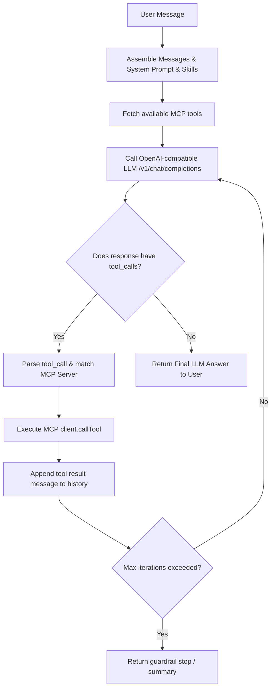

# Phase 1: Core Loop Protocol Engine & MCP Client Setup - Research

## Objective
Establish the foundational loop architecture, configuration structures, MCP client integration, and execution loop with an OpenAI-compatible LLM.

## Key Findings & Technology Choices

### 1. Model Context Protocol (`@modelcontextprotocol/sdk`)
- Transport: `StdioClientTransport` from `@modelcontextprotocol/sdk/client/stdio.js` allows executing local commands (e.g., `npx -y @modelcontextprotocol/server-everything`, custom python/node scripts, or community search MCPs like `@modelcontextprotocol/server-brave-search` / `duckduckgo`).
- Client: `Client` from `@modelcontextprotocol/sdk/client/index.js`.
- Lifecycle:
  1. `client.connect(transport)`
  2. `client.listTools()` -> returns array of tools with `{ name, description, inputSchema }`.
  3. `client.callTool({ name, arguments })` -> returns `{ content: [{ type: "text", text: ... }] }`.

### 2. OpenAI Compatibility & Tool Calling
- Standard format for tools:
  ```json
  {
    "type": "function",
    "function": {
      "name": tool.name,
      "description": tool.description,
      "parameters": tool.inputSchema
    }
  }
  ```
- Tool response role:
  ```json
  {
    "role": "tool",
    "tool_call_id": toolCall.id,
    "content": toolExecutionOutputString
  }
  ```

### 3. Loop Protocol Cycle


### 4. Search MCP Server Options
- Standard fetch / web access or mock search server / DuckDuckGo CLI / custom lightweight search MCP server to guarantee out-of-the-box working search without requiring paid API keys immediately, while allowing plug-and-play Brave Search or Google Search API keys.
