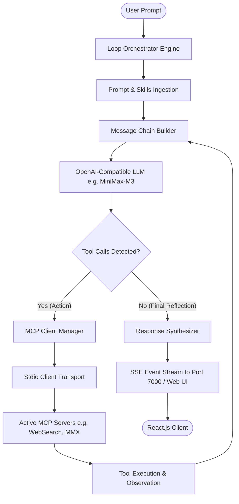

# Architecture & Loop Protocol Specification

## 1. Executive Overview
The **Loop Engineering Chatbot** is an autonomous iterative execution system designed to augment Large Language Models (LLMs) that natively lack direct external capabilities—such as real-time web search, multimodal asset generation, or local code execution.

Rather than relying on closed, proprietary tool platforms, this system implements an open standard host based on the **Model Context Protocol (MCP)** and an **OpenAI-compatible Tool Calling loop**.



---

## 2. Core Architectural Components

### 2.1 Prompt & AI Skill Ingestion Layer
Located at `src/config/schema.ts` and `src/config/index.ts`.
- **System Prompt**: Defines the fundamental operational boundaries, role identity, and reasoning standards.
- **Skills Prompt**: A hot-pluggable instruction block declaring active tools, procedural workflows, and error recovery policies.
- **Dynamic Merging**: Injected at iteration 0 into the conversation message chain under the `system` role.

### 2.2 Model Context Protocol (MCP) Host Layer
Located at `src/mcp/client-manager.ts`.
- **Host Client**: Built with `@modelcontextprotocol/sdk`.
- **Discovery Mechanism**: Queries connected servers on startup (`listTools`) to inspect names, descriptions, and JSON Schemas (`inputSchema`).
- **Translation Engine**: Translates MCP `Tool` definitions directly into OpenAI `ChatCompletionTool` format:
  ```json
  {
    "type": "function",
    "function": {
      "name": "web_search",
      "description": "Search the internet...",
      "parameters": { ... }
    }
  }
  ```
- **Execution Router**: Dispatches tool calls by matching tool names to corresponding `StdioClientTransport` instances.

### 2.3 ReAct Loop Engine (`LoopOrchestrator`)
Located at `src/engine/loop-orchestrator.ts`.
- Implements an autonomous state machine:
  1. `Step Start`: Increments iteration counter, checks guardrails.
  2. `LLM Query`: Dispatches current conversation history + active tool schemas to LLM.
  3. `Evaluation`: Inspects completion choices for `tool_calls`.
  4. `Execution`: If tool calls exist, resolves them in parallel or sequence through MCP.
  5. `Observation Append`: Adds execution output to history with `role: "tool"` and matching `tool_call_id`.
  6. `Loopback`: Feeds the observation back to the LLM so it can reflect and decide next actions.
  7. `Terminal Evaluation`: When the LLM outputs plain text without tool calls, delivers the final answer.

---

## 3. Communication & Streaming Protocol (SSE)
Located at `src/server.ts`.
Events are streamed in real time over HTTP using Server-Sent Events (`POST /api/chat`):

| Event Name | Payload | Description |
|---|---|---|
| `step_start` | `{"iteration": 1}` | Fired when a new loop iteration commences. |
| `tool_call` | `{"toolName": "...", "args": {...}, "timestamp": ...}` | Emitted when LLM requests an MCP action. |
| `tool_result` | `{"toolName": "...", "result": "...", "timestamp": ...}` | Emitted when MCP server returns tool results. |
| `complete` | `{"answer": "...", "iterations": 5}` | Emitted when LLM produces the final synthesized response. |
| `error` | `{"message": "..."}` | Emitted if an unrecoverable failure occurs in the loop. |
