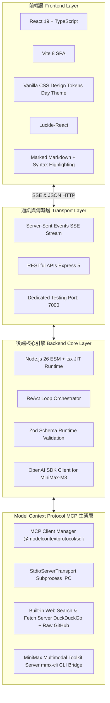

# Technology Stack (技術棧規格說明)

本文件詳細記錄了 **Loop Engineering Chatbot** 系統所採用的完整技術棧架構（Technology Stack），涵蓋後端引擎、前端使用者介面、通訊協議、MCP 生態以及各層級的核心依賴庫與版本資訊。

---

## 1. 系統整體架構全景 (Architecture Stack Overview)

---

## 2. 後端技術棧 (Backend Technology Stack)

後端作為 **Loop Orchestrator** 與 **MCP Host**，採用全 TypeScript ESM 模組化架構構建：

| 組件 / 技術 (Component) | 選用技術 / 庫 (Technology / Library) | 版本 (Version) | 用途與設計決策 (Design Purpose) |
| :--- | :--- | :--- | :--- |
| **執行環境 (Runtime)** | **Node.js** | `>=20.0.0` (驗證通過 Node 26) | 原生支援 ES Modules (`"type": "module"`) 與全域 `fetch()`。 |
| **即時編譯執行器 (Execution)** | **`tsx`** | `^4.23.13` | 無需繁瑣的預編譯，直接以零配置高速執行 TypeScript 原始碼。 |
| **程式語言 (Language)** | **TypeScript** | `^7.0.2` | 提供端到端的嚴格型別安全檢查，消滅執行期型別錯誤。 |
| **HTTP Web 伺服器** | **Express** | `^5.2.1` | 提供 API 路由與單頁應用 (SPA) 靜態檔案託管，支援現代 Express 5 路徑匹配標準。 |
| **跨來源資源共享** | **`cors`** | `^2.8.6` | 允許前端跨域與本機開發環境安全通訊。 |
| **LLM 客戶端協議** | **`openai` (Official SDK)** | `^7.9.0` | 標準化接入任何相容 OpenAI 協定的端點（如 **MiniMax-M3**、DeepSeek、Ollama、vLLM）。 |
| **MCP 協定核心 SDK** | **`@modelcontextprotocol/sdk`** | `^1.30.0` | 官方 Model Context Protocol SDK，負責 Stdio 客戶端/伺服器通訊、工具定義與 JSON-RPC 呼叫。 |
| **資料校驗與配置驗證** | **`zod`** | `^4.5.4` | 在執行期對 `loop.config.json` 及 MCP 伺服器動態註冊表進行嚴格 Schema 驗證。 |
| **環境變數管理** | **`dotenv`** | `^17.4.2` | 自動載入 `.env` 檔案中的 API Key 與 Base URL 等敏感設定。 |
| **終端命令列樣式** | **`chalk`** | `^6.0.0` | 用於互動式 CLI REPL 介面中的語法高亮與彩色 Log 輸出。 |

---

## 3. 前端技術棧 (Frontend Technology Stack)

前端位於 `frontend/` 目錄，是一個輕量、極速、現代化的 Single Page Application (SPA)：

| 組件 / 技術 (Component) | 選用技術 / 庫 (Technology / Library) | 版本 (Version) | 用途與設計決策 (Design Purpose) |
| :--- | :--- | :--- | :--- |
| **核心視圖框架** | **React** | `^19.2.8` | 採用最新的 React 19 核心與 Hooks，管理對話訊息串流與 MCP 工具摺疊狀態。 |
| **建置與開發工具** | **Vite** | `^8.2.2` | 極速 HMR 熱更新，產出體積極小的 production bundle（gzip ~80KB）。 |
| **外觀樣式系統 (Styling)** | **Vanilla CSS + Design Tokens** | Native CSS3 | **嚴格遵從設計規範**，不引入龐大的第三方 CSS 框架；使用 CSS 自訂變數定義純淨清爽的 **Day Theme (白晝淺色主題)**。 |
| **圖標庫 (Icons)** | **`lucide-react`** | `^1.39.0` | 提供優雅輕量的 SVG 圖標（如 `Server`, `Globe`, `Search`, `Eye`, `EyeOff`, `Sparkles`）。 |
| **Markdown 渲染引擎** | **`marked`** | `^18.0.11` | 高效解析 AI 回覆中的 GitHub Flavored Markdown (GFM)、程式碼區塊、表格與清單。 |
| **程式碼檢查器 (Linter)** | **`oxlint`** | `^1.79.0` | 基於 Rust 的新一代超高速 JavaScript/TypeScript 代碼規範檢查工具。 |

---

## 4. MCP 伺服器生態與底層工具 (MCP Servers & Tool Ecosystem)

系統支援動態熱插拔（Hot-reload）各類 MCP Server，目前預設掛載兩大核心伺服器：

### 4.1 內建 Web Search 伺服器 (`builtin-web-search-server`)
- **檔案位置**：`src/mcp/servers/web-search-server.ts`
- **通訊方式**：`StdioServerTransport` (標準輸入/輸出處理進程通訊)
- **暴露工具**：
  1. `web_search`: 具備 DuckDuckGo HTML 爬取能力，並內建 **MiniMax API 自動備用通道**（防止爬蟲被風控阻擋）。
  2. `fetch_page`: 深度網頁內文抓取，內建 **GitHub 智慧網址重寫機制**（自動將 `github.com/blob` 轉換為 `raw.githubusercontent.com` CDN 純文字，避開 HTTP 429 限制）。

### 4.2 MiniMax 多模態伺服器 (`minimax-multimodal-server`)
- **檔案位置**：`src/mcp/servers/minimax-server.ts`
- **通訊方式**：`StdioServerTransport`
- **底層驅動**：封裝 MiniMax 全域 CLI 工具 (`mmx-cli` / `mmx.cmd`)
- **暴露工具**：
  1. `minimax_search`: 透過 MiniMax 官方即時搜尋 API，提供權威搜尋通道。
  2. `minimax_generate_image`: 調用 `image-01` 模型生成高品質圖片。
  3. `minimax_synthesize_speech`: 調用語音模型合成真實語音檔案。
  4. `minimax_generate_music`: 調用音樂生成模型創作音軌。

---

## 5. 網路與通訊協議 (Protocols & Networking)

1. **Server-Sent Events (SSE)**:
   - 端點：`POST /api/chat`
   - 機制：以單向 HTTP 串流方式實時將 Agent 內部的推理歷程推送給前端：
     - `event: step_start` (迭代步驟計數)
     - `event: tool_call` (工具呼叫發起，附帶 Server Attribution 標籤)
     - `event: tool_result` (工具執行回傳觀察)
     - `event: complete` (最終整合回覆輸出)
2. **JSON-RPC 2.0 (MCP Protocol)**:
   - 主進程與子進程之間使用嚴格符合 JSON-RPC 2.0 規範的 Stdio 流進行工具列表發現與執行派發。
3. **連接埠規範 (Port Standardization)**:
   - 全系統標準測試連接埠為 **Port 7000**（`http://localhost:7000`）。
