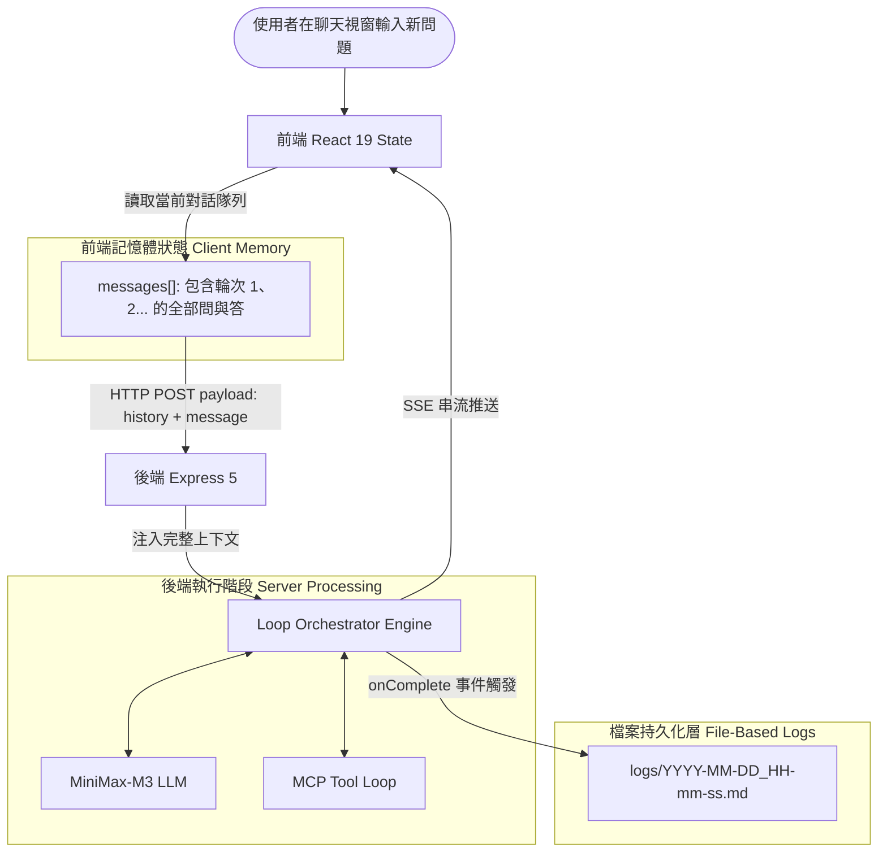

# 對話記憶與上下文延續架構 (Conversation Memory & State Continuity)

本文件詳細剖析在 **Loop Engineering Protocol** 架構下，如何實現讓「AI 小助手」承接歷史輸出、維持長對話記憶（Multi-turn State Continuity）的系統設計與實作策略。

---

## 1. 問題本質：LLM 的「無狀態」特性 (Stateless Nature of LLMs)

大語言模型（LLM）本質上是**完全無狀態的（Stateless）**：
- 模型本身不具備硬碟，亦不會在服務端主動記住「上一位使用者 5 分鐘前講過什麼」。
- 任何單次請求如果只發送最新一句話，模型對先前的討論是**完全不知情（Blank Slate）**的。

要讓「AI 小助手」能參考先前的 Output 繼續對話，唯一的本質途徑是：**每次發送請求時，將先前的對話歷史組裝成結構化的 Message 陣列，重新傳遞給模型的 Context Window**。

```typescript
// 每次呼叫 LLM 時組裝的完整上下文結構：
const messages = [
  { role: "system", content: "你係 AI 小助手..." },
  { role: "user", content: "第 1 輪提問：如何規劃 AD CS HSM 遷移？" },
  { role: "assistant", content: "第 1 輪回答：建議採用雙向交叉簽名 (Cross-Signing)..." },
  { role: "user", content: "第 2 輪提問：針對剛才提到的交叉簽名，可以給出具體 certutil 指令嗎？" } // 👈 帶著歷史！
];
```

---

## 2. 記憶體處理 (In-Memory) vs. 檔案持久化 (File-Based)

在評估「用 File 定係喺 Memory 度做處理」時，兩者並非非此即彼，而是各自承擔不同的系統職責：

| 評估維度 | 做法 A：純記憶體處理 (In-Memory State) | 做法 B：純檔案讀寫 (File-Based Storage) | 做法 C：業界標準混合架構 (Hybrid Architecture) |
| :--- | :--- | :--- | :--- |
| **存放位置** | 前端 React State / 後端 Node.js RAM | 伺服器磁碟上的 `.md` 或 `.json` 檔案 | **即時交互放 Memory，持久歸檔放 File** |
| **讀寫延遲** | ⚡ **極快（< 1ms）**，零 I/O 開銷 | 🐢 每次問答都要磁碟 I/O，具延遲 | ⚡ **極致體驗**：對話零延遲，非同步寫入磁碟 |
| **容災與持久性** | ❌ 重新整理網頁、重啟 Server 記憶即歸零 | ✅ 重啟後仍然完整保留在磁碟中 | ✅ **完美持久化**：重啟後隨時可由檔案載入還原 |
| **擴展性與多租戶** | ⚠️ 伺服器重啟即丟失 Session | ⚠️ 檔案鎖與高並發寫入衝突風險 | 🛡️ **清晰隔離**：前端持有 Session State，後端負責驗證與存檔 |
| **Token 膨脹管理** | ⚠️ 對話過長會超出 Context Window 上限 | ⚠️ 檔案會越來越大，不易直接全部餵給 LLM | 🛡️ **滑動視窗 (Sliding Window)** 或摘要壓縮機制 |

---

## 3. 業界標準架構：Memory + File 混合機制 (Hybrid Architecture)

為兼顧**極速即時對話**與**永久會話存檔**，系統採用 **Memory-First with File Persistence** 的混合架構：



### 架構層面三大分工：
1. **傳輸層 (Transport Layer)**：
   - 前端發起請求時，Payload 由單一的 `{ message }` 升級為包含先前輪次的結構：
     ```json
     {
       "history": [
         { "role": "user", "content": "..." },
         { "role": "assistant", "content": "..." }
       ],
       "message": "最新問題"
     }
     ```
2. **運行時層 (Runtime In-Memory Context)**：
   - 後端 `LoopOrchestrator` 將 `history` 與 `systemPrompt`、`skillsPrompt` 合併，組裝成符合 OpenAI 標準的 `messages` 陣列。
   - LLM 在 Reasoning 時直接能夠看見自己上一輪的推演過程與結論，實現自然的跨輪次追問。
3. **持久化層 (File-Based Session Logs)**：
   - 每輪對話完成後，非同步將該次會話寫入專屬的 `logs/YYYY-MM-DD_HH-mm-ss.md`。
   - 日誌完整記錄 User Prompt、各步驟採用的 MCP Tool Calls 與最終 Synthesized Answer。
   - 未來介面可提供「歷史工作階段載入」按鈕，直接讀取對應的 Markdown 檔案並還原至前端 Memory。

---

## 4. 長對話上下文管理策略 (Context Window Management)

當對話進行到 10 輪以上時，累積的 Token 數量可能會逼近模型的 Context Window 上限。為確保「AI 小助手」長期運行的穩定性，需採用以下治理策略：

### 4.1 滑動視窗 (Sliding Window Buffer)
保留最近的 $N$ 輪完整對話（例如最近 6 輪）：
$$\text{Context} = [\text{System Prompt}] + [\text{Recent } N \text{ Turns}]$$
超過 $N$ 輪的早期對話從 In-Memory 剔除，但完整記錄依然永久安全保存在 `logs/*.md` 檔案中。

### 4.2 摘要壓縮 (Summary Compression / Rolling Memory)
當對話總長度超過閥值（例如 16,000 Tokens）時：
1. 在後台啟動微型 LLM 任務，將前 $K$ 輪的歷史對話壓縮為 200 字以內的「核心背景摘要（Summary）」。
2. 將該摘要作為系統提示詞的一部分注入，後續繼續承接精確的短期記憶。

---

## 5. 總結 (Architectural Conclusion)

> **結論**：  
> 令「AI 小助手」具備連續對話記憶，**「傳送與推論時走 Memory（記憶體），長久留底與復原走 File（檔案）」** 是目前最穩定、速度最高、架構最清晰的黃金標準！
