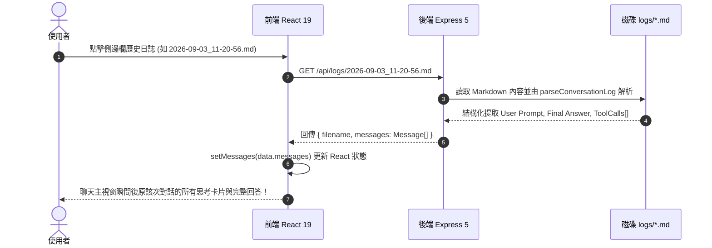

# MiniBot UI/UX & Session Management Specification

本文件詳細記錄了 **MiniBot (AI 小助手)** 在前端使用者介面（UI）、互動體驗（UX）、側邊欄版面佈局（Sidebar Layout）以及歷史工作階段復原（Session Re-hydration）的具體架構設計與實現規範。

---

## 1. 設計哲學與版面佈局 (Layout Philosophy & Aesthetics)

前端採用純淨清爽的 **Day Theme (白晝淺色主題)**，嚴格遵從高對比度、極簡俐落的工程設計語言：
- **調色基調**：以淺灰與純白背景為基底（`--bg-primary: #f8fafc`、`--bg-secondary: #ffffff`），搭配高對比度的深藍工程色（`--accent: #2563eb`）與翡翠綠狀態色（`--accent-emerald: #16a34a`）。
- **無第三方龐大框架**：完全基於原生 Vanilla CSS 自訂變數（CSS Design Tokens），零多餘 CSS Overhead。

```
┌──────────────────────────────────────┬────────────────────────────────────────────────────────┐
│  LOOP ENGG SIDEBAR (320px)           │  CHAT & REASONING STAGE (Flex: 1)                     │
├──────────────────────────────────────┼────────────────────────────────────────────────────────┤
│  [icon] Loop Engg (Port 7000)        │  Header: Status badge · Real-time step counter         │
│  [+] New Chat Button (Primary Blue)  ├────────────────────────────────────────────────────────┤
│                                      │  Message Thread Area:                                  │
│  PAST SESSIONS (Flex: 1)             │  - User message bubble (Right, Accent blue)            │
│  ┌────────────────────────────────┐  │  - Assistant response container (Left, White card)     │
│  │ 💬 2026-09-03_11-27-06         │  │    ├─ Live Collapsible Tool Execution Cards        │
│  │ 💬 2026-09-03_11-20-56         │  │    │  [web-search] web_search(...) ➜ Completed    │
│  │ (Scrollable past chat logs)    │  │    ├─ Markdown Synthesized Answer                   │
│  └────────────────────────────────┘  │    └─ Token estimate badge (~450 tokens · 3 iters)  │
│                                      ├────────────────────────────────────────────────────────┤
│  ✨ Active Model (MiniMax-M3) [>]    │  Bottom Input Bar:                                     │
│  (Compact 38px collapsible bar)      │  [ Ask anything...                       ] [ Send 🚀 ] │
│  ⚙️ Configure LLM & AI Skills        │                                                        │
└──────────────────────────────────────┴────────────────────────────────────────────────────────┘
```

---

## 2. 空間優化：底部可摺疊 Active Model 手風琴 (Collapsible Accordion)

為了在側邊欄留出最大空間供使用者瀏覽長篇歷史對話（`PAST SESSIONS`），我們將原本佔用 300px 高度的模型與 MCP 工具資訊卡片進行了**底部抽屜化摺疊改造**：

### 2.1 預設收合狀態（空間佔用僅 ~38px）
- 僅顯示單行緊湊卡片：
  - 左側：`Sparkles` 圖標與標題 `Active Model (MiniMax-M3)`。
  - 右側：綠色標籤 `6 Tools` 與展開箭頭 `>`。
- 不佔用垂直閱讀空間，讓上方的 `PAST SESSIONS` 能夠自適應延伸拉滿（`flex: 1`）。

### 2.2 點擊展開狀態（On-Demand Expansion）
- 點擊後平滑展開內容區塊：
  1. 當前運行的 LLM 模型名稱。
  2. 已註冊的 MCP Servers（`web-search`、`minimax-multimodal`）及其在線狀態。
  3. 每個 MCP Server 下屬的所有可用工具列表（`web_search`, `fetch_page`, `minimax_search` 等）。
  4. 點擊任何單項工具即可彈出該工具的 JSON Schema 與詳細參數定義視窗。

---

## 3. 工作階段重載機制 (Session Re-hydration Mechanics)

當使用者點擊側邊欄 `PAST SESSIONS` 中的任何一筆歷史記錄時，系統執行完整的**對話時光機還原（Session Re-hydration）**：



### 反解析的保真度（Fidelity）：
1. **問題與回答完整還原**：使用者的提問與 Assistant 的最終 Markdown 答案原汁原味重現。
2. **工具調用卡片完整還原**：
   - 提取各個步驟的 Tool Name、MCP Server 標籤（`[web-search]`）、調用參數（Parameters JSON）以及當時工具返回的真實觀察結果（Observation）。
   - 點擊卡片依然可以展開查看 JSON。
3. **即時無縫續聊**：
   - 載入歷史之後，使用者的下一次發言會直接將這份歷史作為 `history` 送給後端，實現**跨越重啟邊界的無縫連續追問**！

---

## 4. 訊息泡泡與計量標記 (Token & Iteration Metrics)

在每個 Assistant 訊息泡泡的底部，均實時渲染會話消耗指標：
- **Token 估算**：基於字元長度動態計算（`~length / 3.5`），讓操作者即時感知上下文使用量。
- **字元長度 (Character Length)**：精準顯示生成的文本字元總數。
- **迭代步數 (Resolved Iterations)**：標記 AI 小助手歷經多少輪 ReAct 循環才完成任務（例如 `Resolved in 10 iteration(s)`）。

---

## 5. SLS 風格深色毛玻璃彈窗與提示系統 (SLS-Style Alert & Confirm System)

為了提供與現代 Web OS / 儀表板一致的沉浸式互動反饋，前端全面淘汰了瀏覽器原生阻塞式 `window.alert()` 與 `window.confirm()`，引入了源自 `sls` 專案的高階彈窗元件 [`AlertModal.tsx`](file:///Users/billylam/ai/loop-engg/frontend/src/components/AlertModal.tsx)：

### 5.1 視覺架構與質感
- **深色毛玻璃背景遮罩**：採用 `rgba(15, 23, 42, 0.65)` 與 `backdrop-filter: blur(6px)`，突顯當前操作焦點。
- **立體彈出卡片**：16px 圓角、細微白晝邊框（`1px solid var(--border-color)`）與 `modalPop` 微彈跳浮現動畫。
- **情境化色彩圖標與訊息容器**：
  - **Success（成功）**：綠色翡翠徽章、`CheckCircle2` 圖標、綠色淺底訊息框（如配置儲存成功）。
  - **Warning（警告 / 刪除確認）**：琥珀金徽章、`AlertTriangle` 圖標、警示訊息（如永久刪除歷史會話確認）。
  - **Error（錯誤）**：玫瑰紅徽章、`AlertCircle` 圖標、紅色淺底錯誤訊息（如 MCP JSON 語法解析失敗）。
  - **Info（資訊）**：湛藍徽章、`Info` 圖標。

### 5.2 呼叫介面
透過 React 集中狀態管理，支援即時函數式調用：
```tsx
// 提示彈窗
showAlert("系統配置與 MCP 伺服器已成功儲存並完成熱重載！", "success", "配置儲存成功");

// 確認操作彈窗
showConfirm(
  "確定要刪除以下歷史會話記錄嗎？\n此操作將從磁碟永久移除，無法復原！",
  () => executeDelete(),
  "永久刪除確認",
  "確認刪除"
);
```

---

## 6. MCP Servers Registry 彈性 JSON 緩衝編輯器 (Editable Registry Buffer)

在 Configuration 設定視窗中，針對右側的 **Active MCP Servers Registry**，傳統直接綁定 `JSON.stringify(config.mcpServers)` 容易因鍵入過程中的臨時語法殘缺導致焦點遺失與輸入被拒。

### 解決方案：獨立字串緩衝器與語法實時校驗
1. 建立獨立狀態 `mcpJsonText` 與 `mcpJsonError`。
2. 鍵入過程中允許任意暫時性文字編輯、貼上與修改。
3. 實時運行語法分析：若 JSON 格式有殘缺，文字框邊框即時亮紅並顯示詳細語法錯誤位置；若格式完整合法，則紅框自動解除。
4. 點擊「Save & Reload Configuration」時進行嚴格校驗，確保推送至後端 Express 5 的皆為合法 MCP 伺服器宣告物件。
