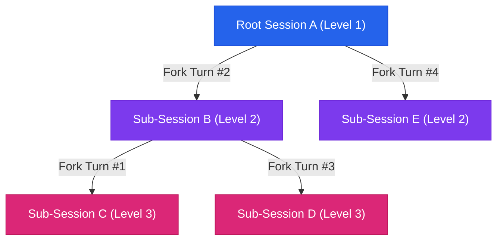

# 12. Workspace Architecture, Multi-Tier Sub-Conversations & Attachment Isolation

## 1. Overview & Architectural Goals

The **Workspace & Conversation Tree Engine** provides a scalable, zero-database file system architecture for organizing multi-turn AI interactions, branching sub-conversations (forking), and managing isolated file attachments.

### Core Principles
1. **Zero External Database Dependency**: All conversations, hierarchy metadata, and workspace structures exist as human-readable Markdown (`.md`) files on disk.
2. **Physical Folder-Based Workspaces**: Workspaces are physically isolated directories under `logs/<workspace_name>/`.
3. **Multi-Tier Recursive Branching**: Any turn (or sequence of turns) can be branched/forked into an independent sub-session, supporting unlimited nesting depths ($N$-tier parent-child hierarchy).
4. **Strict Session-Scoped Content-Addressable Storage (CAS)**: File attachments (spreadsheets, PDFs, text) are referenced by SHA-256 hash. Forked sub-sessions support selective inheritance and strict isolation—mutations in a child session never pollute the parent, and vice-versa.

---

## 2. On-Disk Directory Structure & Naming Conventions

```text
c:\ai\loop-engg\
│
├── logs/                                    <-- Root logging directory
│   ├── default/                             <-- Default workspace folder
│   │   ├── 2026-09-03_15-54-17.md           <-- Root Session file
│   │   ├── 2026-09-04_11-28-06.md           <-- Root Session file (Level 1)
│   │   ├── 2026-09-04_11-30-42.md           <-- Sub-conversation (Level 2 Fork)
│   │   └── 2026-09-04_11-31-54.md           <-- 3rd-level Forked Sub-session (Level 3 Fork)
│   │
│   ├── BigFix-Security-Audit/               <-- Custom workspace directory
│   │   └── 2026-09-04_12-00-00.md
│   │
│   └── README.md
│
└── uploads/                                 <-- Content-Addressable Storage (CAS) for Attachments
    ├── documents.json                       <-- Metadata registry (hash -> fileName, size, sheets)
    └── store/                               <-- Raw binary / parsed text stored by SHA-256 hash
        ├── 0994a42554cdb15cdca80ee059145b024fd95405aa1504e8dd59d7e29e5b1834.bin
        └── 2fcfe87948a9e986738cc6730e82414a0081ef9f0c1c2279394a375f1a272cb9.bin
```

### Naming & Path Sanitization Rules
- **Workspace Directory**:
  ```typescript
  const safeWorkspace = (workspace || "default").replace(/[^\w\d\-_ ]/g, "").trim() || "default";
  const targetDir = path.resolve(process.cwd(), "logs", safeWorkspace);
  ```
  - Disallows path traversal sequences (`..`, `/`, `\`, `:`).
  - `logs/default/` is protected and cannot be deleted or renamed.
- **Session File Names**:
  - Format: `YYYY-MM-DD_HH-mm-ss.md` (e.g. `2026-09-04_11-30-42.md`).
  - Generated from session initiation timestamp for natural chronological sorting on disk.

---

## 3. Markdown Log File Format & Metadata Schema

Each session markdown file contains structured frontmatter metadata, followed by multi-turn conversation blocks:

```markdown
# Conversation Log: 2026-09-04_11-30-42

## Metadata
- **Workspace**: `default`
- **Title**: `[Fork T#3] this is one number 1`
- **Date / Time**: 2026-09-04T03:30:42.968Z (Local: 9/4/2026, 11:30:42 AM)
- **Model**: `Cloned Session`
- **Iterations**: 1
- **Duration**: 0.00s
- **Total Tool Calls**: 0
- **Attached Document Hashes**: `["0994a42554cdb15cdca80ee059145b024fd95405aa1504e8dd59d7e29e5b1834"]`
- **Cloned From**: `2026-09-04_11-28-06.md` (Workspace: default, Turn 3, Mode: up_to)

---

## Turn 1: User Prompt
this is one number 1

---

## Autonomous Loop Tool Calls & Observations (Turn 1)
*No external tools were invoked during this turn.*

---

## Turn 1: Synthesized Answer
Got it! 👍
```

### Key Metadata Fields
- `Attached Document Hashes`: Array of CAS SHA-256 hashes currently bound to this conversation.
- `Cloned From`: Records `parentFilename`, `parentWorkspace`, `turnIndex`, and `mode` (`single` or `up_to`).

---

## 4. Multi-Tier Conversation Tree & Branching



### Tree Reconstruction Algorithm
In the frontend (`App.tsx`), the flat file list is transformed into a hierarchical tree in $O(N)$ time:
1. `sessionMap`: Maps `filename -> session`.
2. `childrenMap`: Maps `parentFilename -> childSessions[]`.
3. `rootSessions`: Identifies sessions where `!clonedFrom || !sessionMap.has(parentFilename)`.
4. Recursive rendering: `renderSessionCard(session, depth)` applies depth-based branch colors (`Purple` $\to$ `Pink` $\to$ `Teal`) and dynamic indentation.

### Deletion & Orphan Fallback Behavior
- When a middle node (e.g. Node B) is deleted:
  - Node C detects `!sessionMap.has(B)` and is **automatically promoted to a root conversation** without data loss.
  - No broken pointers, orphan errors, or cascade corruption.

---

## 5. Attachment Isolation & Selective Forking

### Content-Addressable Storage (CAS)
- Files uploaded via the Attachment modal are hashed (`SHA-256`) and stored in `uploads/store/<hash>.bin`.
- Session logs store only string references (`Attached Document Hashes: ["<hash1>", ...]`).

### Selective Forking Flow
When branching a session in `SubConversationModal`:
1. The modal inspects the parent session's `attachedDocHashes`.
2. Document details (file names, types, sizes) are fetched via `/api/documents/by-hashes`.
3. The user can **Select All**, **Deselect All (0 attachments)**, or **select individual attachments** via checkboxes.
4. The server creates the new cloned `.md` file with the selected hashes:
   ```typescript
   export function cloneConversationTurn(
     filename: string,
     turnIndex: number,
     mode: "single" | "up_to" = "up_to",
     workspace: string = "default",
     targetWorkspace?: string,
     customDocHashes?: string[]
   )
   ```

### Isolation Guarantees
- **Parent Mutation Isolation**: Uploading new files or detaching documents in the parent session after forking has **zero impact** on previously cloned sub-conversations.
- **Child Mutation Isolation**: Modifying attachments in a child branch does not mutate the parent's `attachedDocHashes`.

---

## 6. API Endpoints Reference

| Method | Endpoint | Description |
|---|---|---|
| `GET` | `/api/workspaces` | List all workspace folders and session counts. |
| `POST` | `/api/workspaces` | Create a new workspace directory (`{ name: string }`). |
| `POST` | `/api/workspaces/:name/rename` | Rename an existing workspace (`{ newName: string }`). |
| `DELETE` | `/api/workspaces/:name` | Delete a workspace folder and all contained `.md` logs. |
| `GET` | `/api/logs?workspace=:ws` | List all conversation summaries in a workspace (including `attachedDocCount` & `clonedFrom`). |
| `GET` | `/api/logs/:filename?workspace=:ws` | Load structured multi-turn conversation and attached document hashes. |
| `POST` | `/api/logs/:filename/clone-turn` | Fork a turn with `{ turnIndex, mode, workspace, customDocHashes }`. |
| `POST` | `/api/logs/:filename/rename` | Rename a session's custom title. |
| `DELETE` | `/api/logs/:filename?workspace=:ws` | Delete an individual session file safely. |
| `POST` | `/api/documents/by-hashes` | Query document metadata specifically for an array of CAS hashes. |
