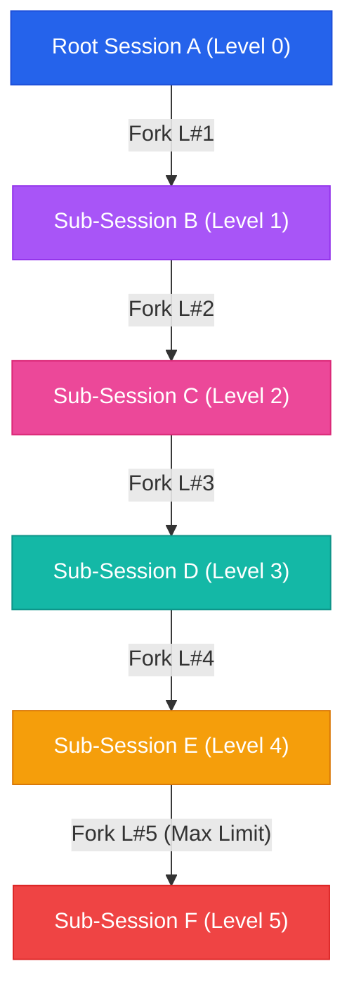
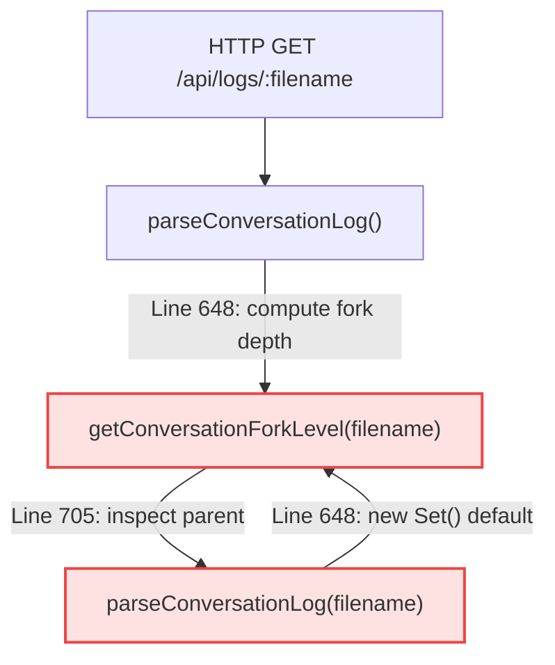

# 12. Workspace Architecture, Multi-Tier Sub-Conversations & Attachment Isolation

## 1. Overview & Architectural Goals

The **Workspace & Conversation Tree Engine** provides a scalable, zero-database file system architecture for organizing multi-turn AI interactions, branching sub-conversations (forking), and managing isolated file attachments.

### Core Principles
1. **Zero External Database Dependency**: All conversations, hierarchy metadata, and workspace structures exist as human-readable Markdown (`.md`) files on disk.
2. **Physical Folder-Based Workspaces**: Workspaces are physically isolated directories under `logs/<workspace_name>/`.
3. **Multi-Tier Recursive Branching**: Any turn (or sequence of turns) can be branched/forked into an independent sub-session, supporting unlimited nesting depths ($N$-tier parent-child hierarchy).
4. **Strict Session-Scoped Content-Addressable Storage (CAS)**: File attachments (spreadsheets, PDFs, text) are referenced by SHA-256 hash. Forked sub-sessions support selective inheritance and strict isolation—mutations in a child session never pollute the parent, and vice-versa.

---

## 2. On-Disk Directory Structure & Naming Conventions

```text
c:\ai\loop-engg\
│
├── logs/                                    <-- Root logging directory
│   ├── default/                             <-- Default workspace folder
│   │   ├── 2026-09-03_15-54-17.md           <-- Root Session file
│   │   ├── 2026-09-04_11-28-06.md           <-- Root Session file (Level 1)
│   │   ├── 2026-09-04_11-30-42.md           <-- Sub-conversation (Level 2 Fork)
│   │   └── 2026-09-04_11-31-54.md           <-- 3rd-level Forked Sub-session (Level 3 Fork)
│   │
│   ├── BigFix-Security-Audit/               <-- Custom workspace directory
│   │   └── 2026-09-04_12-00-00.md
│   │
│   └── README.md
│
└── uploads/                                 <-- Content-Addressable Storage (CAS) for Attachments
    ├── documents.json                       <-- Metadata registry (hash -> fileName, size, sheets)
    └── store/                               <-- Raw binary / parsed text stored by SHA-256 hash
        ├── 0994a42554cdb15cdca80ee059145b024fd95405aa1504e8dd59d7e29e5b1834.bin
        └── 2fcfe87948a9e986738cc6730e82414a0081ef9f0c1c2279394a375f1a272cb9.bin
```

### Naming & Path Sanitization Rules
- **Workspace Directory**:
  ```typescript
  const safeWorkspace = (workspace || "default").replace(/[^\w\d\-_ ]/g, "").trim() || "default";
  const targetDir = path.resolve(process.cwd(), "logs", safeWorkspace);
  ```
  - Disallows path traversal sequences (`..`, `/`, `\`, `:`).
  - `logs/default/` is protected and cannot be deleted or renamed.
- **Session File Names**:
  - Format: `YYYY-MM-DD_HH-mm-ss.md` (e.g. `2026-09-04_11-30-42.md`).
  - Generated from session initiation timestamp for natural chronological sorting on disk.

---

## 3. Markdown Log File Format & Metadata Schema

Each session markdown file contains structured frontmatter metadata, followed by multi-turn conversation blocks:

```markdown
# Conversation Log: 2026-09-04_11-30-42

## Metadata
- **Workspace**: `default`
- **Title**: `[Fork T#3] this is one number 1`
- **Date / Time**: 2026-09-04T03:30:42.968Z (Local: 9/4/2026, 11:30:42 AM)
- **Model**: `Cloned Session`
- **Iterations**: 1
- **Duration**: 0.00s
- **Total Tool Calls**: 0
- **Attached Document Hashes**: `["0994a42554cdb15cdca80ee059145b024fd95405aa1504e8dd59d7e29e5b1834"]`
- **Cloned From**: `2026-09-04_11-28-06.md` (Workspace: default, Turn 3, Mode: up_to)

---

## Turn 1: User Prompt
this is one number 1

---

## Autonomous Loop Tool Calls & Observations (Turn 1)
*No external tools were invoked during this turn.*

---

## Turn 1: Synthesized Answer
Got it! 👍
```

### Key Metadata Fields
- `Attached Document Hashes`: Array of CAS SHA-256 hashes currently bound to this conversation.
- `Cloned From`: Records `parentFilename`, `parentWorkspace`, `turnIndex`, and `mode` (`single` or `up_to`).

---

## 4. Multi-Tier Conversation Tree & Branching (Max 5 Levels)



### 5-Tier Fork Level Constraint
To maintain directory clarity and avoid runaway tree recursion, the system enforces a strict maximum fork depth of **5 levels**:
- **Depth Calculation**: `getConversationForkLevel(filename)` traverses the session's `clonedFrom.parentFilename` ancestor chain using an iterative, non-recursive header scanner (`readClonedFromMetadata`) that reads only the top 2KB of parent files without invoking full markdown parsing, eliminating any risk of circular recursion or stack exhaustion.
- **Backend Rejection**: If `nextForkLevel > 5`, `/api/logs/:filename/clone-turn` rejects the request with an explicit error.
- **Frontend Prevention**: When a Level 5 conversation is inspected in `SubConversationModal`, fork action buttons are automatically locked with a `Max Fork Level (5) Reached` badge.

### Tree Reconstruction & Color Coding
In the sidebar (`App.tsx`), the flat file list is transformed into a hierarchical tree with level-tailored color accents:
- **Root (Level 0)**: `var(--accent)` (Blue)
- **Level 1**: `#a855f7` (Purple)
- **Level 2**: `#ec4899` (Pink)
- **Level 3**: `#14b8a6` (Teal)
- **Level 4**: `#f59e0b` (Amber)
- **Level 5 (Max)**: `#ef4444` (Red)

### Deletion & Orphan Fallback Behavior
- When a middle node is deleted:
  - Descendants detect `!sessionMap.has(parentFilename)` and are **automatically promoted to a root conversation** without data loss.
  - No broken pointers, orphan errors, or cascade corruption.

### 4.4 Incident Autopsy: Circular Mutual Recursion Lockup & Non-Recursive Header Scanner

#### The Incident (Server Hang on Fork Inspection)
When inspecting or detailing a forked session via `GET /api/logs/:filename`, the single-threaded Node.js server suddenly surged to **98.5% CPU** in an infinite loop, freezing the event loop and dropping all incoming HTTP requests.

#### Root Cause Analysis

1. **Unbounded Mutual Recursion**:
   - `parseConversationLog()` attempted to populate the `forkLevel` property by calling `getConversationForkLevel(filename)`.
   - `getConversationForkLevel()` attempted to determine whether the file had a parent by invoking `parseConversationLog(filename)`.
   - Because `parseConversationLog` did not accept or forward the `visited` cycle detection set, each invocation initialized a fresh `new Set()`, completely bypassing recursion detection.
   - For root files with no parents, the recursion ran until Node hit `RangeError: Maximum call stack size exceeded`, which was caught silently by an inner `catch { return 0 }`. However, for forked files containing an actual ancestor pointer, the mutual recursion branched across parent lookups, causing CPU spinning and thread starvation.
2. **Backtick Delimiter Corruption**:
   - When users forked a turn starting with code fences (e.g. ````mermaid`), the raw content was sliced directly into the markdown title: `- **Title**: \`[Fork L#1 T#1] ```mermaid\``. This created mismatched backtick delimiters in the file header.

#### Architectural Solution: Decoupled Iterative Header Scanner
To permanently eliminate circular dependency and CPU lockups, the fork depth calculator was completely decoupled from full log parsing:
1. **Lightweight Header Reader (`readClonedFromMetadata`)**:
   Instead of loading or parsing the entire multi-turn markdown body (messages, tool calls, thinking tags), a dedicated scanner opens the file descriptor and reads **only the first 2KB**:
   ```typescript
   const fd = fs.openSync(fullPath, "r");
   const buffer = Buffer.alloc(2048);
   const bytesRead = fs.readSync(fd, buffer, 0, 2048, 0);
   fs.closeSync(fd);
   ```
2. **Iterative `while` Traversal**:
   `getConversationForkLevel` is implemented as an iterative loop with a hard depth guard (`depth < 20`) and `visited` Set:
   ```typescript
   export function getConversationForkLevel(filename: string, workspace = "default", ...): number {
     let depth = 0;
     let currentFile = filename;
     let currentWs = workspace;
     const visited = new Set<string>();

     while (currentFile && !visited.has(currentFile) && depth < 20) {
       visited.add(currentFile);
       const meta = readClonedFromMetadata(currentFile, currentWs, baseDir, userNumber);
       if (!meta || !meta.parentFilename) break;
       depth += 1;
       currentFile = meta.parentFilename;
       currentWs = meta.parentWorkspace || currentWs;
     }
     return depth;
   }
   ```
3. **Zero-Overhead Short-Circuiting**:
   In `parseConversationLog`, root conversations (`!clonedFrom`) bypass the traversal entirely:
   ```typescript
   const forkLevel = clonedFrom ? getConversationForkLevel(filename, workspace, baseDir, userNumber) : 0;
   ```
4. **Header Sanitization**:
   In `cloneConversationTurn`, user prompts are sanitized with `.replace(/[`\r\n]+/g, " ")` before composing title tags, guaranteeing well-formed markdown headers.

---

## 5. Attachment Isolation, CAS Fallback & Cross-User State Purging

### Content-Addressable Storage (CAS) Fallback
- Files uploaded are hashed (`SHA-256`) and stored in user directory `storage/users/{userNumber}/documents/`.
- `DocumentManager` implements a **hierarchical fallback lookup**:
  1. Checks user-specific index `storage/users/{userNumber}/index/documents-index.json`.
  2. Falls back to global shared repository `storage/index/documents-index.json` to seamlessly preserve access to pre-existing session attachments.

### Selective Forking Flow
When branching a session in `SubConversationModal`:
1. The modal inspects the parent session's `attachedDocHashes`.
2. Document details (file names, types, sizes) are fetched via `/api/documents/by-hashes` with `credentials: "include"`.
3. The user can **Select All**, **Deselect All (0 attachments)**, or **select individual attachments** via checkboxes.
4. The server creates the new cloned `.md` file with the selected hashes:
   ```typescript
   export function cloneConversationTurn(
     filename: string,
     turnIndex: number,
     mode: "single" | "up_to" = "up_to",
     workspace: string = "default",
     targetWorkspace?: string,
     customDocHashes?: string[],
     baseDir: string = "logs",
     userNumber: string = "00000"
   )
   ```

### Cross-User State Purging (Zero Leakage)
- **React Component Remounting**: `RootApp` keys the main `App` component by `currentUser.id` (`<App key={currentUser.id} />`).
  - Switching between users completely destroys the previous user's React state (messages, active file, attachments), eliminating any need for manual cache clearing or browser F5 refresh.
- **Markdown User-Tag Matching**: Every session markdown file contains `- **User**: <userNumber>`. Backend APIs (`parseConversationLog` and `listConversationLogs`) verify ownership against the active session token and strictly block unauthorized cross-user reading.

---

## 6. API Endpoints Reference

| Method | Endpoint | Description |
|---|---|---|
| `GET` | `/api/workspaces` | List all workspace folders and session counts. |
| `POST` | `/api/workspaces` | Create a new workspace directory (`{ name: string }`). |
| `POST` | `/api/workspaces/:name/rename` | Rename an existing workspace (`{ newName: string }`). |
| `DELETE` | `/api/workspaces/:name` | Delete a workspace folder and all contained `.md` logs. |
| `GET` | `/api/logs?workspace=:ws` | List all conversation summaries in a workspace (including `attachedDocCount` & `clonedFrom`). |
| `GET` | `/api/logs/:filename?workspace=:ws` | Load structured multi-turn conversation and attached document hashes. |
| `POST` | `/api/logs/:filename/clone-turn` | Fork a turn with `{ turnIndex, mode, workspace, customDocHashes }`. |
| `POST` | `/api/logs/:filename/rename` | Rename a session's custom title. |
| `DELETE` | `/api/logs/:filename?workspace=:ws` | Delete an individual session file safely. |
| `POST` | `/api/documents/by-hashes` | Query document metadata specifically for an array of CAS hashes. |
