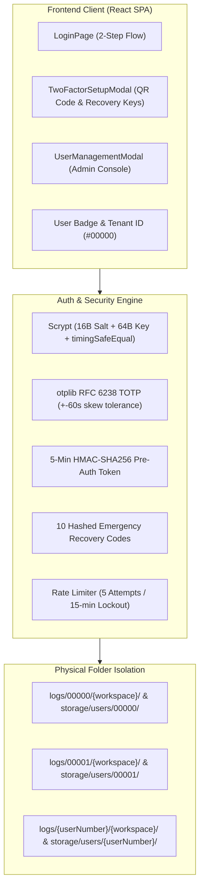

# 13. Multi-User System, Folder Isolation & 2FA Architecture

## 1. Overview
`loop-engg` adopts an enterprise-grade multi-tenant architecture inspired by `sls`, offering rigorous user isolation, Scrypt password hashing, and RFC 6238 Time-Based One-Time Password (TOTP) two-factor authentication.



---

## 2. Directory Structure on Disk

```
loop-engg/
├── config/
│   ├── users.json          # User accounts, password hashes, 2FA status, recovery code hashes
│   └── sessions.json       # Active session cookies (30-day HttpOnly)
├── logs/                   # Isolated conversation logs & workspaces per user
│   ├── 00000/              # Admin tenant directory
│   │   ├── default/
│   │   └── my-workspace/
│   ├── 00001/              # User 1 tenant directory
│   └── {userNumber}/       # User N tenant directory
└── storage/
    └── users/              # Isolated uploaded attachments & preprocessing caches
        ├── 00000/          # Admin documents & indices
        └── {userNumber}/   # User N documents & indices
```

---

## 3. 2-Step Login & 2FA Flow

1. **Step 1 (Credential Verification)**:
   - User inputs `username` and `password`.
   - Backend performs Scrypt hashing with the stored salt and verifies in constant-time using `crypto.timingSafeEqual`.
   - If 2FA is **disabled**: Issues `loop_session` cookie directly.
   - If 2FA is **enabled**: Issues a short-lived (5 min) HMAC-SHA256 `preAuthToken` and returns `{ step: "totp_required" }`.

2. **Step 2 (TOTP Challenge)**:
   - User provides the 6-digit dynamic code from Google Authenticator / 1Password (or an 8-character Emergency Recovery Code).
   - Backend verifies the HMAC `preAuthToken` integrity and checks the code against `otplib.verifySync` with a 60-second clock drift tolerance.
   - Upon success, issues the 30-day `loop_session` HttpOnly cookie.

---

## 4. Default Admin Provisioning
- **Username**: `admin`
- **Password**: `admin123`
- **Tenant ID**: `00000`
- **Role**: `admin`
