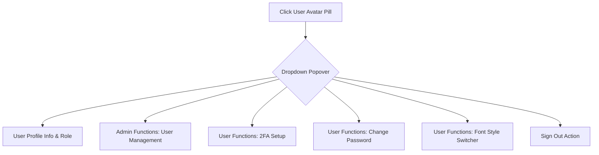

# 14. Outlook-Style Interface & Visual Design Architecture

## Overview
This document specifies the visual architecture, layout principles, and design system of **Mini Chat Bot** (`loop-engg`). The application adopts an **Outlook / modern productivity console design philosophy**, prioritizing clean spatial hierarchy, responsive multi-pane organization, accessible typography, and role-driven user interactions.

```
+---------------------------------------------------------------------------------------------------------+
|                                    MINI CHAT BOT APPLICATION FRAMEWORK                                  |
+------------------------------------+--------------------------------------------------------------------+
|  LEFT SIDEBAR (345px fixed)        |  MAIN WORKSPACE & HEADER (flex: 1)                                 |
|                                    |                                                                    |
|  +------------------------------+  |  +--------------------------------------------------------------+  |
|  | Brand: Mini Chat Bot         |  |  | Status | Thinking View | MCP View | Export HTML | [User Menu]v|  |
|  | Port 7000 / MCP Protocol     |  |  +--------------------------------------------------------------+  |
|  +------------------------------+  |                                                                    |
|  | WORKSPACE ACCORDION SELECTOR |  |  +--------------------------------------------------------------+  |
|  | Folders, New, Rename, Delete |  |  | MULTI-TURN CHAT CONVERSATION THREAD                          |  |
|  +------------------------------+  |  |                                                              |  |
|  | [+ New Chat] Action Button   |  |  | - User Queries & Turn Badges                                |  |
|  +------------------------------+  |  | - Collapsible <think> Reasoning Blocks                       |  |
|  | CHAT SESSION TREE HIERARCHY  |  |  | - Expandable MCP Observation Trace Cards                     |  |
|  | - Multi-tier fork depth      |  |  | - Markdown & Formula Renderer                                |  |
|  | - Timestamps & Document tags |  |  +--------------------------------------------------------------+  |
|  | - Inline Title Rename/Delete |  |                                                                    |
|  +------------------------------+  |  +--------------------------------------------------------------+  |
|  | ACTIVE MODEL ACCORDION       |  |  | PROMPT INPUT & ATTACHMENT COMPOSER                           |  |
|  | Dynamic server tool counters |  |  | [Attach Docs] [Input textarea...] [Send Loop Button]         |  |
|  +------------------------------+  +--------------------------------------------------------------+  |
+------------------------------------+--------------------------------------------------------------------+
```

---

## 1. Design Philosophy & Aesthetic Principles

1. **Information Density with Breathing Room**:
   - Structured panels with clear borders (`1px solid var(--border-color)`), avoiding cluttered visual noise while maximizing productivity.
2. **Predictable Navigation**:
   - Fixed left sidebar for navigation, session recall, model discovery, and workspace organization.
   - Fluid right-hand pane for reasoning loops, conversation stream, and prompt creation.
3. **Harmonious Color Palette**:
   - Light-mode default with slate neutrals and deliberate semantic accent colors (Blue for actions, Purple for admin/forks, Green for success/active status, Amber for 2FA warnings, Red for danger).
4. **Native System Typography (Segoe UI / San Francisco Stack)**:
   - Zero-latency native system font rendering matching Windows and macOS desktop productivity applications.

---

## 2. Design System Tokens & Color Variables

The visual hierarchy is anchored on semantic CSS custom properties defined in [`frontend/src/index.css`](file:///c:/ai/loop-engg/frontend/src/index.css):

```css
:root {
  /* Surface Layers */
  --bg-primary: #f8fafc;      /* Canvas / Outer background */
  --bg-secondary: #ffffff;    /* Sidebar & Popovers surface */
  --bg-card: #f1f5f9;         /* Interactive cards, chips, input backgrounds */
  --bg-glass: rgba(255, 255, 255, 0.9);

  /* Borders & Dividers */
  --border-color: #e2e8f0;    /* Structural divider lines */

  /* Typography */
  --text-main: #0f172a;       /* Primary text / Headings */
  --text-muted: #64748b;      /* Subtitles, timestamps, secondary labels */

  /* Semantic Color Accents */
  --accent: #0284c7;          /* Primary Sky Blue */
  --accent-glow: rgba(2, 132, 199, 0.15);
  --accent-emerald: #16a34a;  /* Success / Active engine status */
  --accent-amber: #d97706;    /* Warnings / 2FA status */
  --accent-purple: #7c3aed;   /* Administration & Sub-turn forks */

  /* Typography Stacks */
  --font-family: 'Segoe UI', system-ui, -apple-system, BlinkMacSystemFont, Roboto, sans-serif;
  --font-mono: ui-monospace, SFMono-Regular, SF Mono, Menlo, Consolas, Liberation Mono, monospace;
}
```

---

## 3. Structural Components

### A. Top Navigation Header & User Dropdown
The top navigation bar provides high-level session status and consolidated action menus:

- **Engine Health Pill**: Real-time pulsing green dot indicating active background loop status.
- **Segmented View Switches**:
  - **Thinking Response**: Segmented control (`Hide` | `Minimize` | `Full`) for deep reasoning blocks.
  - **MCP Response**: Segmented control (`Hide` | `Minimize` | `Full`) for tool call inspection.
- **Export HTML Action**: Standalone offline HTML export button (`12px`, `font-weight: 600`).
- **SLS-Style Avatar Dropdown Trigger**:
  - Compact rounded pill displaying user initial badge, display name, tenant identifier (`#00000`), and animated chevron.
  - **Structured Popover Menu**:
    - **User Card**: Full name, `@username`, uppercase role chip (`ADMIN` / `USER`).
    - **Admin Functions** (Role-guarded): `User Management` modal trigger.
    - **User Functions**: `2FA Authentication` (with live `ON` / `OFF` indicator) and `Change Password`.
    - **Sign Out Action**: Distinct red-themed logout action with automatic outside-click listener.



- **Font Selector (User Preference)**:
  - Users can select between **`Segoe UI`** (Native Windows / OS system font, default) and **`Roboto`** (Google Font).
  - Persisted in browser `localStorage` and dynamically applied to the `<html>` root attribute (`data-font="segoe-ui" | "roboto"`).

---

### B. User Management Console (SLS-Style)
The administrative management console provides user provisioning, folder tenant verification, and access controls:

- **Header Bar**: Purple icon badge with descriptive subtitle and quick `+ Add User` action.
- **Table Data Grid**:
  - **Tenant ID**: 5-digit tenant badge (`00000`) linking to isolated file storage.
  - **User & You Pill**: Identifies active authenticated session.
  - **Display Name**: Clean typography with instant inline editable field.
  - **Role Badge**: Purple `ADMIN` or Blue `USER` chip.
  - **Status Pill**: Green `UserCheck Active` vs Red `UserX Disabled`.
  - **2FA Status Badge**: Green `2FA ON` vs Gray `OFF`.
  - **Last Login**: Monospace formatted timestamp.
- **Inline Editing (No Modal Popups for Edit)**:
  - Clicking <kbd>✏️</kbd> converts the row into live `<input>` and `<select>` controls with inline `✓ Save` and `Cancel` buttons.
- **Inline Password & 2FA Reset**:
  - One-click admin override for forgotten passwords or locked 2FA devices.

---

### C. Left Navigation Sidebar
- **Brand Card**: Gradient CPU icon with port badge (`Port 7000`) and protocol status.
- **Workspace Selector Card**:
  - Native select picker displaying active session counts.
  - Inline buttons for creating new workspace folders and renaming existing ones.
- **Multi-Tier Conversation Tree**:
  - Recursive fork branches with visual indentations and branch connector borders.
  - Attachment indicators (`📎 N docs`) and quick sub-conversation clone tools.
- **Active Model & Tools Accordion**:
  - Collapsible drawer showing the currently loaded LLM model, connected MCP servers, and individual tool definitions.

---

## 4. Typography Scale & Standards

| Element | Font Family | Size | Weight | Line Height | Usage |
|---|---|---|---|---|---|
| **App Title** | `var(--font-family)` | `16px` | `700` | `1.2` | Sidebar Brand Header |
| **Modal Header** | `var(--font-family)` | `16px` | `700` | `1.2` | User Management & Settings Modals |
| **Table Headers** | `var(--font-family)` | `12px` | `600` | `1.2` | Data Grid Headers (`Tenant ID`, `User`) |
| **Action Buttons** | `var(--font-family)` | `12px` | `600` | `1.0` | `Export HTML`, `Save`, `Cancel`, `Users` |
| **Body & Messages** | `var(--font-family)` | `14px` | `400` | `1.65` | Markdown message bodies |
| **Badges & Tags** | `var(--font-family)` | `10px - 11px` | `600 - 700` | `1.0` | `ADMIN`, `Active`, `2FA ON` |
| **Monospace / Code** | `var(--font-mono)` | `11px - 12.5px` | `500 - 700` | `1.4` | Tenant IDs (`#00000`), Timestamps, `<pre><code>` |

---

## 5. Summary
The Outlook-inspired interface combines the speed of desktop productivity software with the flexibility of modern web applications. The visual layout establishes clear boundaries between system management and conversational AI workflows while maintaining consistency across all UI components.
