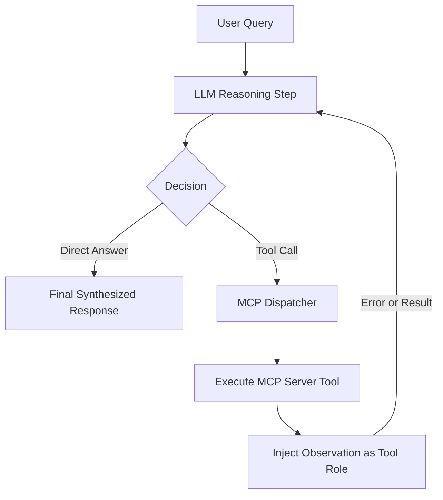

# Agentic Looping & Autonomous Self-Correction: Architecture Discussion

This document records the design insights, behavioral analysis, and architectural discussion surrounding the autonomous ReAct loop execution in the **Loop Engineering Protocol** system.

---

## 1. Executive Summary

During testing of complex enterprise infrastructure scenarios (specifically: *Microsoft ADCS CA server migration with non-exportable HSM private keys*), our system encountered an actual real-world network/scraping failure in Step 1. 

Instead of failing or halting the conversation, the autonomous ReAct loop demonstrated self-correction, query reformulating, and successful retrieval in Step 2. This document captures the technical autopsy of this execution, explaining why traditional single-turn chatbots fail and how our Agentic Loop guarantees high-integrity outcomes.

---

## 2. Real-World Execution Log Analysis

### Step 1: Initial Tool Call & Failure
The LLM initially generated a tool call targeting the `web_search` MCP server:

```json
Tool Call: web_search
PARAMETERS:
{
  "query": "CA server HSM migration new HSM key cannot export re-key strategy"
}
OBSERVATION (MCP RESPONSE):
Error performing web search for "CA server HSM migration new HSM key cannot export re-key strategy": fetch failed
```

#### Root Cause Analysis:
1. **Low-level Socket/TLS Abort (`fetch failed`)**: Node 18+ wraps underlying OS network issues (`ECONNRESET`, `ETIMEDOUT`, or anti-bot challenge) as a generic `TypeError: fetch failed`.
2. **Query Structure**: The query was relatively colloquial (`"new HSM key cannot export"`) and long, which can trigger strict WAF rate limits or anti-scraping challenges on public search endpoints.

---

### Step 2: Autonomous Recovery & Precision Retrieval

In a traditional chat architecture without loops, the execution would have immediately stopped with an error message (*"Sorry, search failed"*). 

In our **Loop Engineering Orchestrator**, the error was injected into the conversation chain as a tool observation (`role: "tool"`). The model evaluated the failure and autonomously adjusted its strategy:

```json
Tool Call: web_search
PARAMETERS:
{
  "query": "Microsoft ADCS CA migration HSM key non-exportable new root cross-signing best practice"
}
OBSERVATION (MCP RESPONSE):
[Result 1]
Title: Migrate a Certification Authority in Windows Server | Microsoft Learn
URL: https://learn.microsoft.com/en-us/windows-server/identity/ad-cs/migrate-certification-authority

[Result 2]
Title: AzureHSMEssentials/migration/adcs-migration/docs/_README_migration.md ...
URL: https://github.com/microsoft/AzureHSMEssentials/blob/main/migration/adcs-migration/docs/_README_migration.md

[Result 3]
Title: AzureHSMEssentials/migration/adcs-migration/docs/migration-guide ...
URL: https://github.com/microsoft/AzureHSMEssentials/blob/main/migration/adcs-migration/docs/migration-guide-issuingca-crosssigned.md

[Result 4]
Title: Migrating a not-exportable Private Key - Securosys Docs
URL: https://docs.securosys.com/ms-pki-adcs/Tutorials/Migrating-MSPKI/Migrating-MSPKI-NonExportable/

[Result 5]
Title: Microsoft AD CS Tutorials for HSM Integration | Securosys Docs
URL: https://docs.securosys.com/ms-pki-adcs/category/tutorials/
```

#### Why Step 2 Succeeded:
1. **Query Term Refinement**: Transformed colloquial intent into exact industry nomenclature:
   - Replaced general terms with `"Microsoft ADCS"`.
   - Specifically targeted architectural solutions: `"cross-signing"` (trust bridging between old and new CAs) and `"non-exportable"`.
2. **Deterministic Output**: Retrieved Microsoft's official `Invoke-CaMigration.ps1` documentation, cross-signing bridge guides, and Securosys HSM whitepapers.

---

## 3. Core Principles of the Loop Engineering Architecture



### 1. Error Resilience as First-Class State
Errors are not exceptions that crash the application. In this architecture, an error is simply another **Observation** passed back to the LLM. The model analyzes the error signature and decides whether to:
- Retry with refined arguments.
- Switch to an alternative MCP server (e.g., fallback from `web_search` to `minimax_search`).
- Synthesize an explanation if no tool can satisfy the request.

### 2. Multi-MCP Server Attribution
Each tool execution in the streaming UI displays:
- **Tool Name** (`web_search`, `fetch_page`, `minimax_search`, etc.)
- **Owning MCP Server Tag** (`[web-search]`, `[minimax-multimodal]`)
- **Execution State & Payload**: Inspected parameters, raw observations, and timestamps.

### 3. Loop Guardrails
To prevent infinite loops when a service is permanently down:
- `maxLoopIterations` strictly limits the loop lifecycle (configurable in `loop.config.json` or live UI).
- 8-second `AbortController` timeouts prevent hanging socket connections.
- The UI retains historical step counters (`Iterating: Step 1`, `✓ 2 Loop Iterations`).

---

## 4. Key Takeaways & Recommendations

1. **Dual Search Redundancy**:
   - Maintain both internal scraping tools (`web_search`) and official direct APIs (`minimax_search`).
   - If public scraping gets throttled by regional network boundaries, the agent can fall back to the dedicated API channel.
2. **Transparent Observability**:
   - Exposing the live ReAct logs to the user establishes trust, demonstrating that the AI is actively cross-referencing authoritative engineering sources rather than hallucinating answers.
