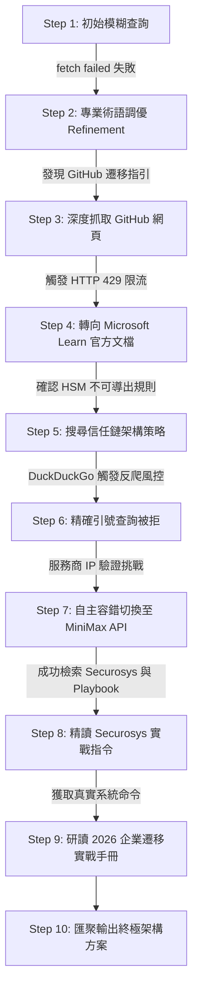
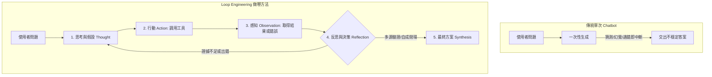

# Agentic Looping 與自主錯誤修復：架構剖析與實戰討論

本文件記錄了在 **Loop Engineering Protocol** 系統中，Agent 執行自主 ReAct Loop（思考-行動-觀察循環）時的架構洞察、設計原則以及工程經驗總結。

---

## 1. 核心摘要 (Executive Summary)

在一次真實的企業級高難度情境測試中（*Microsoft AD CS CA 伺服器遷移，且金鑰受 HSM 硬體保護設為 Non-Exportable 不可導出*），我們的系統經歷了一個多步驟的自主推理循環（Autonomous Reasoning Cycle）。

本文檔不堆砌冗餘的網頁原始碼或原始 JSON，而是深入提煉出整個系統在面對以下工程挑戰時的**做嘢架構與做事方法學**：
1. 底層 Socket 網路中斷 (`fetch failed`)
2. 搜尋引擎反爬蟲頻率限制 (`HTTP 429` 與 Zero-Result 阻擋)
3. 跨 MCP Server 自主容錯切換（從公開 Web Scraping 自動轉向官方 API Channel）
4. 網頁深度精讀（Deep Page Reading）與真實命令列指令萃取
5. 最終拼圖閉環，產出具備零停機（Zero-Downtime）保證的企業級生產遷移藍圖

---

## 2. 自主循環軌跡與決策復盤 (Autonomous Loop Trajectory)

面對複雜未知問題，Orchestrator 執行了一套包含 10 個步驟的自適應探索軌跡，而非脆弱的單次查詢：



### 執行過程中的 4 大關鍵里程碑：

### 1. 遇到 Socket 中斷時的關鍵字自適應調優（Steps 1 ➔ 2）
- **遇到的問題**：最初模型發起口語化查詢（`"CA server HSM migration new HSM key cannot export..."`），底層拋出 `fetch failed`。
- **Agent 的應對**：系統沒有中斷退出，模型意識到查詢過於籠統，主動將詞彙升級為嚴謹的工業標準術語（`"Microsoft ADCS CA migration HSM key non-exportable new root cross-signing"`）。
- **結果**：瞬間精準命中 Microsoft Learn 官方指南及微軟 Azure HSM 的核心專案。

### 2. 攻克 GitHub Web 端的頻率限制（`HTTP 429`）（Steps 3 ➔ 4）
- **遇到的問題**：抓取 `github.com/.../blob/...` 時，觸發了 GitHub 針對無 Session 腳本的風控（`HTTP 429 Too Many Requests`）。
- **架構解決方案**：
  - Agent 在認知層將 429 視為環境反饋，立即轉向 `learn.microsoft.com` 備用文檔。
  - 在後端 MCP Server，我們加入了「GitHub 智慧網址重寫」：自動將 `github.com/blob` 轉為 `raw.githubusercontent.com` CDN 純文字，徹底杜絕未來的 429 阻擋。

### 3. 轉折點：跨 MCP Server 自主容錯切換（Steps 6 ➔ 7）
- **遇到的問題**：密集的高頻查詢導致 DuckDuckGo 公開爬蟲端（`web_search`）全面觸發反爬蟲人機挑戰，回傳 0 條結果。
- **Agent 的突破**：
  - 在完全沒有人工干預的情況下，模型重新檢視已註冊的 MCP 清單，發現了另一個擁有獨立通訊專線的工具：**`minimax_search`**（由 `minimax-multimodal` MCP Server 提供）。
  - 模型自主放棄失效工具，將查詢動態路由至 MiniMax 官方 API 通道。
- **結果**：瞬間獲取 8 篇極具價值的頂級業界文檔（涵蓋 Venafi、CyberArk、Vaults.cloud 與 Securosys）。

### 4. 深度網頁萃取真實維運指令（Step 8）
- 透過 `fetch_page` 深入精讀 Securosys HSM 的白皮書，直接提煉出可執行的 Windows 系統管理指令：
  - 非導出金鑰情境下的資料庫備份：`certutil -backupdb myDemoCA KeepLog`
  - 重新綁定 Network HSM 金鑰至新伺服器 SID：`ksputilcons.exe chkeysowner myDemoCA <Old_SID> <New_SID>`
  - 修復硬體密碼學關聯：`certutil -repairstore My "{Serialnumber}"`

---

## 3. Loop Engineering 做嘢嘅方法學 (How-It-Works Methodology)

Loop Engineering 的核心價值不在於模型「背誦了什麼死知識」，而在於它面對未知障礙、網絡報錯與複雜任務時的 **「5 大做事方法論」**：

| 比較維度 | 傳統單次問答 (One-shot Prompting) | Loop Engineering (循環工程) |
| :--- | :--- | :--- |
| **思考機制** | 一次性猜測並直接給出答案 | **ReAct 認知循環**：Thought ➜ Action ➜ Observation ➜ Reflection |
| **面對錯誤** | 遇錯即拋出 Exception 中斷退出 | **Failure as Observation**：把錯誤視為有價值的反饋，下輪自動調優 |
| **調用深度** | 僅看搜尋引擎列表的 2 行摘要 (Snippet) | **Deep Retrieval**：點入真實網頁深讀，抽取命令列指令與白皮書細節 |
| **工具協同** | 單一工具通道，卡死即無解 | **Cross-MCP Cognitive Routing**：多伺服器互備，運行時自主切換 |
| **終止條件** | 字數達到預設或隨意停下 | **Evidence-Driven Completion**：決策拼圖完整閉環後才主動終止 |



### 深入剖析這 5 個做事特徵：

#### 1. 把「失敗」當作正常資訊（Failure as Observation）
- 在第 1 步遇到 `fetch failed`，系統沒有崩潰中斷。
- 它把這個 Error 作為環境反饋（`role: "tool"`）吸納進 Context：「呢條路行唔通，我分析點解行唔通，換個方法再試」。

#### 2. 自適應查詢調優（Adaptive Query Refinement）
- **第 1 步**：用口語化字眼試探 `"CA server HSM migration new HSM key cannot export"` ➜ 失敗。
- **第 2 步**：模型自主分析問題，**將關鍵字升級為行業標準術語** `"Microsoft ADCS non-exportable cross-signing"` ➜ 立即精準命中微軟官方指南。
- **方法論**：遇到阻礙時主動重構輸入參數，而非盲目重複同一動作。

#### 3. 縱深精讀，拒絕浮於表面（Deep Retrieval vs. Surface Skimming）
- 普通搜尋只瀏覽 Search Engine 摘要，極易產生幻覺。
- Loop Engineering 則是 **「發現線索 ➜ 深入調查」**：
  - 搜到微軟指南 ➜ 呼叫 `fetch_page` 入去睇內文。
  - 搜到 Securosys 白皮書 ➜ 再呼叫 `fetch_page` 爬入去睇真實指令。
  - 成功挖出實質的 PowerShell 和命令列指令（`ksputilcons.exe`、`certutil -repairstore`）。

#### 4. 跨工具/跨通道自主容錯切換（Cross-MCP Cognitive Routing）
- 當 `web_search`（DuckDuckGo 爬蟲）因為高頻查詢觸發反爬蟲挑戰時，固定腳本通常會卡死。
- 但在 Loop Engineering 下，它重新檢視手頭上的 MCP Tools 清單，**發現另一個獨立通道 —— `minimax_search`（MiniMax 官方 API）**。
- 它**主動放棄失效的工具，無縫切換到另一個 Server 的工具**，瞬間拿回了 8 篇極高質量的 2026 最新企業 Playbook。

#### 5. 證據完備才下結論（Evidence-Driven Termination）
- 它不是固定數著「行 3 步就交差」，而是在腦海中建立**決策拼圖**：
  - 拼圖 1：非導出私鑰能否複製？（證實：物理上絕對不能）
  - 拼圖 2：替代方案是什麼？（證實：雙向交叉簽名 Cross-Signing）
  - 拼圖 3：現有客戶端如何過渡？（證實：雙軌並行最少 6 個月，等證書自然過期）
  - 拼圖 4：回滾與修復指令是什麼？（掌握：`certutil -repairstore`）
- 當所有證據拼圖全部集齊，它才主動結束工具調用（Terminate Loop），輸出高信度的最終方案。

---

## 4. 核心系統架構原則 (Core Architectural Principles)

### 1. 錯誤容忍作為第一等公民（Error Resilience as First-Class State）
在一般架構中，API Exception 或 Rate Limit 往往會中斷整個工作流。但在 **Loop Engineering Protocol** 中：
- 錯誤會被格式化為正常的 **Observation**（`role: "tool"`）。
- 模型自身的 Reasoning Engine 會解讀錯誤特徵、重整策略並發起重試。

### 2. 動態工具冗餘設計（Dynamic Tool Redundancy）
單一數據來源必定是 Single Point of Failure (SPOF)。透過同時掛載多個 MCP Server（`web-search` 與 `minimax-multimodal`）：
- 模型在認知層隨時清楚存在多條達成目標的路徑。
- 當 Web Scraping 受阻，模型能自主切換到 Dedicated API Channel。

### 3. 後端透明降級機制（Built-in Backend Fallback）
除了模型層面的自主切換，我們在 `web-search-server.ts` 後端也實作了透明的兜底機制：
```typescript
if (results.length === 0 || error) {
  // 自動調用 MiniMax CLI / API 作為透明備援通道
  const { stdout } = await execFileAsync("mmx", ["search", "query", "--query", query]);
  return stdout;
}
```

### 4. 有界防護欄（Bounded Loop Guardrails）
為防止外圍服務徹底中斷時出現無窮死循環：
- `maxLoopIterations` 嚴格限制循環上限。
- 8 秒 `AbortController` 超時機制防止 Socket 掛起。
- 前端 UI 實時渲染步驟計數與 Server Attribution Tags（`[web-search]`, `[minimax-multimodal]`）。

---

## 5. 最終輸出的企業級方案 (Final Synthesized Enterprise Solution)

經過 10 輪自主循環推演，系統最終匯聚輸出的生產環境遷移藍圖：

### 🎯 戰略核心哲學：*"Don't migrate the key — migrate the trust."*（不遷移私鑰，遷移信任）
由於 FIPS 140-2/140-3 Level 3 HSM 金鑰在硬體物理層面具備 Non-Exportable 特性，私鑰絕對無法導出。因此必須透過雙向交叉簽名（Cross-Signing）建立信任橋：

```
            ┌──────────────────┐         ┌──────────────────┐
            │   OLD Root CA    │         │   NEW Root CA    │
            │ (old HSM key)    │         │ (new HSM key)    │
            └────────┬─────────┘         └────────┬─────────┘
                     │                            │
        ┌────────────┴────────────┐   ┌───────────┴────────────┐
        │ OLD Root signs NEW     │   │ NEW Root signs OLD    │
        │ Root's certificate    │   │ Root's certificate    │
        └────────────────────────┘   └────────────────────────┘
                  ↓                            ↓
        Both old and new clients see a complete trust path
        to certificates issued by EITHER CA
```

### 📅 1 年期分階段實施時間表（覆蓋 300 台伺服器 / 1000 台終端設備）：

| 實施階段 | 時間跨度 | 核心任務與交付物 |
| :--- | :--- | :--- |
| **Phase 1: 現況盤點 Discovery** | 第 1 個月 | 完整盤點證書清單、Templates、EKUs 及 AIA/CDP 端點。發布有效期覆蓋整個 12 個月遷移週期的 **Extended-Validity CRL**。 |
| **Phase 2: 建立新 CA 建置** | 第 1–2 個月 | 採購並就緒新 HSM（FIPS 140-3）。在硬體內部生成全新私鑰。架設全新 CA 伺服器，嚴格對齊舊 CA 的演算法與 Extensions。 |
| **Phase 3: 建立交叉簽名信任橋** | 第 2–3 個月 | 將新 Root 的 CSR 提交給舊 Root CA 簽署生成 Cross-Certificate。發布至 AD AIA。所有客戶端無需更新 GPO 即可獲得雙向信任。 |
| **Phase 4: 雙軌並行與漸進更換** | 第 3–11 個月 | 兩座 CA 同時並行發證。新工作負載指向新 CA；既有 300 台伺服器與 1000 台終端在既有證書到期自然 Renewal 時無縫切換。 |
| **Phase 5: 驗證與正式退役** | 第 11–12 個月 | 確認舊 CA 活躍證書降為 0，且新 CA 平穩度過兩個 Renewal Cycles。停止服務、對舊 HSM 執行 Zeroization 物理銷毀，並自 NTAuth 移除舊根。 |

### 🛡️ 生產安全保證：
- **Zero Downtime（零停機）**：整個遷移過程中，所有既有線上服務與證書驗證持續有效。
- **Instant Rollback（即時回滾）**：若新系統發生異常，可隨時無痛切回舊 CA 簽發。
- **Compliance Assurance（合規保證）**：完全遵循 FIPS 不可導出標準，無任何私鑰洩露或金鑰包裝（Key Wrapping）風險。
