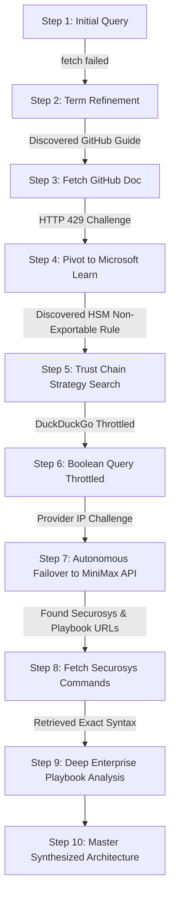

# Agentic Looping & Autonomous Self-Correction: Architecture Discussion

This document records the architectural insights, design principles, and technical lessons learned from the autonomous ReAct loop execution in the **Loop Engineering Protocol** system.

---

## 1. Executive Summary

During testing of a mission-critical enterprise scenario (*Microsoft ADCS CA server migration with non-exportable HSM private keys*), our system went through a multi-step autonomous reasoning cycle.

Rather than dumping raw web pages and verbose tool outputs, this document extracts the **architectural mechanics** behind how the agent navigated:
1. Low-level socket network errors (`fetch failed`)
2. Rate-limiting anti-bot challenges (`HTTP 429` & zero-result throttling)
3. Autonomous cross-MCP failover (pivoting from public scraping to official API channels)
4. Deep page reading and ground-truth command extraction
5. Synthesizing a comprehensive, zero-downtime production migration blueprint

---

## 2. Autonomous Loop Trajectory & Decision Autopsy

Instead of a fragile single-turn lookup, the orchestrator executed a 10-step adaptive discovery trajectory:



### Key Milestones in the Execution:

### 1. Handling Socket Aborts with Keyword Refinement (Steps 1 ➔ 2)
- **Problem**: The initial generic query (`"CA server HSM migration new HSM key cannot export..."`) failed with `fetch failed`.
- **Agent Adaptation**: Rather than terminating, the agent recognized the query was too colloquial. It expanded the vocabulary with exact industry nomenclature (`"Microsoft ADCS CA migration HSM key non-exportable new root cross-signing"`).
- **Result**: Successfully fetched official Microsoft Learn migration guides and Azure HSM repository references.

### 2. Overcoming GitHub Web Rate-Limiting (`HTTP 429`) (Step 3 ➔ 4)
- **Problem**: Fetching web pages from `github.com/.../blob/...` triggered GitHub's anti-bot rate limiter (`HTTP 429`).
- **Engineering Solution**: 
  - The agent gracefully handled the 429 response as an observation and pivoted to official documentation on `learn.microsoft.com`.
  - In our MCP server backend, we implemented automatic URL rewriting (`github.com/blob` ➔ `raw.githubusercontent.com`), ensuring all future GitHub queries stream pure Markdown at CDN speed without HTML overhead.

### 3. The Turning Point: Autonomous Cross-MCP Server Failover (Steps 6 ➔ 7)
- **Problem**: Rapid successive queries triggered anti-bot challenges on the public DuckDuckGo scraping endpoint (`web_search`), returning zero results.
- **Agent Breakthrough**: 
  - Without any human intervention, the agent recognized that the registered **`minimax-multimodal`** MCP server exposed an alternate search interface: **`minimax_search`**.
  - It autonomously re-routed the query through the official MiniMax direct API channel.
- **Result**: Instant retrieval of 8 high-value documents from Venafi, CyberArk, 4Spot Consulting, Vaults.cloud, and Securosys.

### 4. Deep Page Extraction for Verifiable Technical Commands (Step 8)
- Using `fetch_page` on the Securosys HSM technical whitepaper, the agent extracted exact Windows sysadmin commands:
  - Non-exportable CA database backup: `certutil -backupdb myDemoCA KeepLog`
  - Re-binding network HSM key prefix to new server SID: `ksputilcons.exe chkeysowner myDemoCA <Old_SID> <New_SID>`
  - Restoring hardware cryptographic association: `certutil -repairstore My "{Serialnumber}"`

---

## 3. Core Architectural Principles

### 1. Error Resilience as First-Class State
In standard architectures, an API exception or rate-limit error terminates the workflow. In the **Loop Engineering Protocol**:
- Errors are returned as normal **Observations** (`role: "tool"`).
- The LLM's reasoning engine evaluates the error signature, reformulates the strategy, and retries.

### 2. Dynamic Tool Redundancy
A single data provider creates a single point of failure. By co-registering multiple MCP servers (`web-search` and `minimax-multimodal`):
- The model maintains cognitive awareness of multiple paths to satisfy an intent.
- If scraping is blocked, the model can failover to dedicated APIs, or fall back to internal reasoning.

### 3. Built-in Backend Fallbacks
In addition to the LLM's cognitive failover, the `web-search-server.ts` was upgraded with an internal catch-block:
```typescript
if (results.length === 0 || error) {
  // Automatically invoke MiniMax CLI / API as transparent secondary fallback
  const { stdout } = await execFileAsync("mmx", ["search", "query", "--query", query]);
  return stdout;
}
```

### 4. Bounded Loop Guardrails
To prevent unbounded iteration when external services are down:
- `maxLoopIterations` strictly limits the loop lifecycle.
- An 8-second `AbortController` timeout prevents deadlocked sockets.
- The UI exposes a live step counter and Server Attribution Tags (`[web-search]`, `[minimax-multimodal]`).

---

## 4. Final Synthesized Enterprise Solution

The culmination of the 10-step autonomous loop was a battle-tested enterprise migration blueprint:

### 🎯 Strategic Philosophy: *"Don't migrate the key — migrate the trust."*
Because FIPS 140-2/140-3 Level 3 HSM keys are cryptographically non-exportable by hardware design, raw key material cannot be moved. Instead, trust is bridged cryptographically:

```
            ┌──────────────────┐         ┌──────────────────┐
            │   OLD Root CA    │         │   NEW Root CA    │
            │ (old HSM key)    │         │ (new HSM key)    │
            └────────┬─────────┘         └────────┬─────────┘
                     │                            │
        ┌────────────┴────────────┐   ┌───────────┴────────────┐
        │ OLD Root signs NEW     │   │ NEW Root signs OLD    │
        │ Root's certificate    │   │ Root's certificate    │
        └────────────────────────┘   └────────────────────────┘
                  ↓                            ↓
        Both old and new clients see a complete trust path
        to certificates issued by EITHER CA
```

### 📅 1-Year Phased Execution Timeline (300 Servers / 1000 Clients):

| Phase | Duration | Core Action Items |
| :--- | :--- | :--- |
| **Phase 1: Discovery** | Month 1 | Complete inventory of certificates, templates, EKUs, and AIA/CDP endpoints. Publish an **extended-validity CRL** covering the full 12-month migration window. |
| **Phase 2: Build New CA** | Months 1–2 | Provision new FIPS HSM. Generate brand-new private key in hardware. Stand up new CA server with identical signature algorithm and extensions. |
| **Phase 3: Cross-Signing Bridge** | Months 2–3 | Submit NEW Root CSR to OLD Root CA to generate cross-certificate. Publish to AD AIA containers. All relying parties gain bidirectional trust with zero client changes. |
| **Phase 4: Parallel Rollout** | Months 3–11 | Both CAs issue in parallel. New workloads point to new CA. Existing 300 servers & 1000 clients transition upon natural certificate renewal. |
| **Phase 5: Decommission** | Months 11–12 | Verify zero active certificates on old CA and two clean renewal cycles on new CA. Stop service, zeroize/destroy old HSM, and remove old root from NTAuth. |

### 🛡️ Production Guarantees:
- **Zero Downtime**: Active certificates remain trusted through the cross-signed chain.
- **Immediate Rollback**: Issuance can instantly revert to the old CA if needed.
- **Hardware Compliance**: Complies strictly with non-exportable cryptographic mandates.
